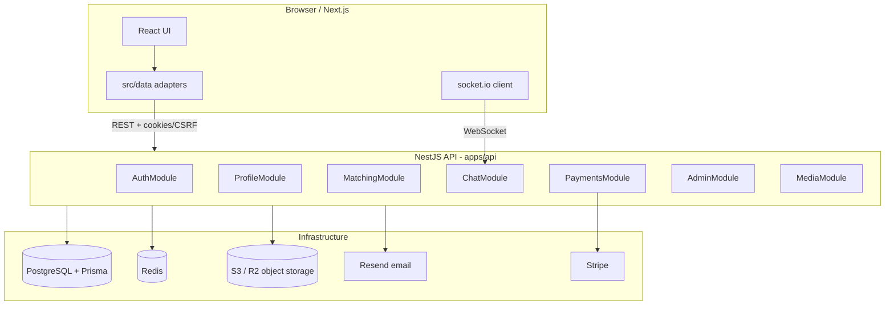

# Hel Calafkaaga — Backend & Database Developer Guide

**Purpose:** Complete handoff for developers building or maintaining the application.  
**Last updated:** July 2026  
**Live:** `https://helcalafkaaga.com` (frontend) + Nest API on Render  
**Repo:** Monorepo (`npm` workspaces)

Related reports:
- Website: `FULL_REPORT.md`
- Mobile (Capacitor): `FULL_REPORT_MOBILE.md`

---

## 1. What this product is

Hel Calafkaaga is a halal Muslim marriage matchmaking platform. Members:

1. Register with email + password  
2. Choose gender and complete a questionnaire  
3. Pay (Stripe or EVC / M-PESA) — trial does **not** unlock access  
4. Discover compatible profiles, like/pass, and chat on mutual match  
5. Manage profile, privacy, support, and **delete their own account**

Staff (`admin` / `owner`) use an admin panel for approvals, payments, reports, and support.

---

## 2. Architecture (high level)



| Layer | Technology |
|--------|------------|
| Frontend | Next.js 16, React 19, TypeScript, Tailwind, shadcn/ui |
| Backend | NestJS 11 (`apps/api`) |
| Database | PostgreSQL 16 + Prisma ORM |
| Cache / queues | Redis (rate limits, BullMQ jobs, Socket.IO adapter) |
| Files | S3-compatible storage (MinIO locally, Cloudflare R2 in production) |
| Payments | Stripe Checkout + EVC proof upload (manual admin approval) |
| Email | Resend (or `console` driver in dev) |
| Realtime chat | Socket.IO with Redis adapter |

**Important:** The frontend talks **only** to the Nest API via `src/data/**` adapters. There is no Convex or dual-backend switch in production code.

---

## 3. Repository structure

```
/
├── apps/api/                 # NestJS backend (main server)
│   ├── prisma/
│   │   ├── schema.prisma     # Database schema (source of truth)
│   │   └── migrations/       # SQL migrations
│   ├── src/
│   │   ├── auth/             # Login, register, sessions, password reset
│   │   ├── profile/          # Profile, questionnaire, photos, preferences
│   │   ├── matching/         # Discover, likes, matches, compatibility scores
│   │   ├── chat/             # Conversations, messages, Socket.IO gateway
│   │   ├── payments/         # Stripe + EVC
│   │   ├── admin/            # Staff panel APIs, deletion, moderation
│   │   ├── media/            # Signed uploads + media proxy
│   │   ├── notifications/
│   │   ├── redis/            # Rate limiting
│   │   └── queue/            # Background jobs (scores, emails, metrics)
│   └── test/                 # HTTP e2e tests
├── src/                      # Next.js frontend
│   ├── app/                  # App Router pages
│   ├── components/           # UI components
│   └── data/                 # API client + hooks (frontend ↔ Nest)
├── infra/
│   └── docker-compose.yml    # Local Postgres, Redis, MinIO
├── packages/migration/       # Legacy Convex → Postgres import tools
└── docs/                     # Runbooks and phase docs
```

---

## 4. Local development setup

### 4.1 Prerequisites

- Node.js 20+
- Docker + Docker Compose (for Postgres, Redis, MinIO)
- `npm install` at repo root

### 4.2 Start infrastructure

```bash
cp infra/.env.example infra/.env
# Edit infra/.env — set POSTGRES_PASSWORD and MINIO_ROOT_PASSWORD

docker compose -f infra/docker-compose.yml up -d postgres redis minio minio-init
```

Services:

| Service | URL |
|---------|-----|
| PostgreSQL | `localhost:5432` |
| Redis | `localhost:6379` |
| MinIO (S3) | `http://127.0.0.1:9000` |
| MinIO console | `http://127.0.0.1:9001` |

### 4.3 Configure API

```bash
cp apps/api/.env.example apps/api/.env
npm run prisma:generate -w @hel/api
npm run prisma:migrate:dev -w @hel/api
```

### 4.4 Run API + frontend

```bash
# Terminal 1 — API (port 4000 by default in .env.example)
npm run dev:api

# Terminal 2 — Next.js (port 3000)
cp .env.example .env.local
# Set NEXT_PUBLIC_API_URL=http://127.0.0.1:4000
# Set NEXT_PUBLIC_SOCKET_URL=http://127.0.0.1:4000
npm run dev
```

### 4.5 Bootstrap first admin (optional)

```bash
npm run bootstrap:admin
```

### 4.6 Full stack via Docker (alternative)

```bash
docker compose -f infra/docker-compose.yml up --build
```

---

## 5. Environment variables

### 5.1 API (`apps/api/.env`)

| Variable | Required | Purpose |
|----------|----------|---------|
| `DATABASE_URL` | Yes | PostgreSQL connection string |
| `REDIS_URL` | Yes | Redis for rate limits, queues, sockets |
| `SESSION_SECRET` | Yes (prod) | Session signing (min 32 chars) |
| `S3_ENDPOINT`, `S3_ACCESS_KEY_ID`, `S3_SECRET_ACCESS_KEY` | Yes | Object storage |
| `S3_BUCKET_PROFILE`, `S3_BUCKET_PROFILE_PRIVATE`, `S3_BUCKET_CHAT`, `S3_BUCKET_EVC`, `S3_BUCKET_SUPPORT` | Yes | Bucket names by purpose |
| `CORS_ORIGINS` | Yes | Comma-separated frontend origins |
| `APP_URL` | Yes | Public site URL (emails, redirects) |
| `COOKIE_SECURE`, `COOKIE_DOMAIN` | Prod | Session cookie settings |
| `TRUST_PROXY` | Prod | `true` behind Render/load balancer |
| `MAIL_DRIVER` | Yes | `console` (dev) or `resend` |
| `RESEND_API_KEY`, `RESEND_FROM` | If Resend | Transactional email |
| `STRIPE_SECRET_KEY`, `STRIPE_WEBHOOK_SECRET` | If Stripe | Payments |
| `STRIPE_GATEWAY` | Dev | Use `fake` for tests without Stripe |

See `apps/api/.env.example` for full list.

### 5.2 Frontend (`.env.local`)

| Variable | Purpose |
|----------|---------|
| `NEXT_PUBLIC_API_URL` | Nest API base URL |
| `NEXT_PUBLIC_SOCKET_URL` | Socket.IO URL (usually same as API) |
| `NEXT_PUBLIC_APP_URL` | Public site URL |
| `NEXT_PUBLIC_STRIPE_PUBLISHABLE_KEY` | Stripe client key |

Stripe **secret** and webhook secret live on the API host only (Render), not in Next.js.

---

## 6. Database (PostgreSQL + Prisma)

### 6.1 Schema location

- **File:** `apps/api/prisma/schema.prisma`
- **Client:** Generated to `@prisma/client` via `npm run prisma:generate -w @hel/api`

### 6.2 Migrations

```bash
# Create migration (local dev only)
npm run prisma:migrate:dev -w @hel/api -- --name your_change

# Apply on production (also runs automatically on API deploy)
npm run prisma:migrate:deploy -w @hel/api
```

**Never** run `prisma migrate reset` on shared or production databases.

Production deploy (`start:prod`) runs `prisma migrate deploy` before starting the server.

### 6.3 Core data model

Every user has a **`users`** row and usually a **`profiles`** row (1:1).

```
users
  ├── auth_accounts      (password provider, hash never logged)
  ├── sessions           (hashed tokens, expiry)
  ├── profile            (questionnaire + visibility + payment flags)
  ├── preferences        (partner preferences)
  ├── likes_sent / likes_received
  ├── matches_as_a / matches_as_b
  ├── messages_sent
  ├── payments
  ├── notifications
  ├── blocks, reports
  └── media_objects      (photos, chat images)
```

#### Key tables

| Table | Purpose |
|-------|---------|
| `users` | Identity: email, gender, phone |
| `auth_accounts` | Password hash (`lucia_scrypt`), provider linkage |
| `profiles` | Full member profile + `review_status`, `has_paid`, `photo_visibility` |
| `preferences` | Match filters (age, height, countries, etc.) |
| `compatibility_scores` | Precomputed match % between user pairs |
| `likes` | like / pass / shortlist actions |
| `matches` | Mutual likes; links to `conversations` |
| `conversations` / `messages` | Chat threads |
| `payments` | Stripe sessions + fulfillment state |
| `evc_payment_proofs` | Mobile money screenshot proofs |
| `media_objects` | S3 file metadata |
| `notifications` | In-app notifications |
| `audit_logs` | Admin actions |
| `deletion_jobs` | Account deletion audit trail |
| `support_contacts` / `support_messages` | Member ↔ staff support |
| `reports` / `blocks` | Safety & moderation |

#### Important enums

| Enum | Values | Used for |
|------|--------|----------|
| `UserRole` | `user`, `admin`, `owner` | Access control |
| `ReviewStatus` | `incomplete`, `pending_review`, `approved`, `rejected`, `suspended` | Profile approval |
| `PhotoVisibility` | `everyone`, `matches`, `private` | Who sees photos |
| `LikeAction` | `like`, `pass`, `shortlist` | Discover actions |
| `PaymentType` | `registration`, `registration_premium`, `premium_upgrade`, `chat` | Billing |
| `RegistrationTier` | `basic`, `premium` | $10 vs $20 plans |

#### Legacy `convex_id` columns

Many tables still have `convex_id` / `convex_user_id` fields from the original Convex migration. New records generate local UUID-style IDs. Do not remove these columns without a migration plan.

---

## 7. How authentication works

### 7.1 Flow

1. `POST /auth/register` or `POST /auth/login`  
2. API creates a **session** row (token stored as SHA-256 hash only)  
3. Response sets cookies + returns `sessionToken` and `csrfToken`  
4. Frontend stores tokens in `sessionStorage` (cross-site Vercel ↔ Render)  
5. All mutating requests send `X-CSRF-Token` + session cookie/header  
6. `GET /auth/me` returns user + `accessState` (routing hints)

### 7.2 Guards (Nest)

| Guard / Decorator | Effect |
|-------------------|--------|
| `@Public()` | No auth required |
| Default `AuthGuard` | Requires valid session |
| `@RequireProfile()` | User must have a profile row |
| `@RequirePaid()` | User must have paid access (or trial rules) |
| `@Roles('admin')` | Staff only |
| `CsrfGuard` | CSRF on mutating routes |
| `RateLimitGuard` | Redis-backed limits |

### 7.3 Password security

- Hashing: **Lucia Scrypt** (primary) with Argon2 support for legacy  
- Password reset: `password_reset_tokens` table, emailed link  
- One email → one account (normalized email uniqueness enforced in `auth.service.ts`)

### 7.4 Session headers

| Header / Cookie | Purpose |
|-----------------|---------|
| Session cookie | Primary auth (when same-site) |
| `X-Session-Token` | Fallback for cross-origin |
| `hel_csrf` cookie + `X-CSRF-Token` | CSRF protection |

---

## 8. Member lifecycle & access routing

Backend computes `accessState` in `apps/api/src/common/access-state.ts`:

```
Register → Choose gender → Questionnaire → Payment → Dashboard / Discover
```

| Step | `nextRoute` | DB flags |
|------|-------------|----------|
| No gender | `/register/details` | `registration_complete = false` |
| Incomplete questionnaire | `/questionnaire` | `questionnaire_complete = false` |
| Unpaid | `/payment` | `has_paid = false` (`trialEndsAt` does **not** grant access) |
| Ready | `/dashboard` | paid + questionnaire complete |
| Staff | `/admin` | `role = admin \| owner` |
| Banned | `/login` | `banned = true` |

Women may need **admin approval** (`review_status = pending_review`) before full discover access — see `review-status.ts`.

---

## 9. API modules & endpoints

Base URL: `{NEXT_PUBLIC_API_URL}` — no `/api` prefix.

### 9.1 Auth — `/auth`

| Method | Path | Description |
|--------|------|-------------|
| POST | `/auth/register` | Create account |
| POST | `/auth/register/check-email` | Email availability |
| POST | `/auth/login` | Sign in |
| POST | `/auth/logout` | End session |
| POST | `/auth/logout-all` | Revoke all sessions |
| GET | `/auth/me` | Current user + accessState |
| POST | `/auth/forgot-password` | Send reset email |
| POST | `/auth/reset-password` | Reset with token |
| POST | `/auth/change-password` | Change password (logged in) |
| POST | `/auth/register/complete` | Set gender after register |

### 9.2 Profile — `/profile`

| Method | Path | Description |
|--------|------|-------------|
| GET | `/profile/me` | Own profile |
| PATCH | `/profile/me` | Update name, phone, etc. |
| GET | `/profile/access-state` | Routing / gate flags |
| POST | `/profile/questionnaire/*` | Autosave, complete, edits |
| POST | `/profile/photos/sign-upload` | Get S3 presigned upload URL |
| POST | `/profile/photos/confirm-upload` | Attach uploaded photo |
| DELETE | `/profile/photos/:id` | Remove photo |
| DELETE | `/profile/account` | **Self-delete account** (password required) |
| GET | `/profile/:id/photo-access/:mediaId` | Authorized photo URL |

### 9.3 Preferences — `/preferences`

| Method | Path | Description |
|--------|------|-------------|
| GET | `/preferences/me` | Partner preferences |
| PUT/PATCH | `/preferences/me` | Update preferences |

### 9.4 Matching — `/matches` (requires paid access)

| Method | Path | Description |
|--------|------|-------------|
| GET | `/matches/discover` | Browse profiles (grid/swipe) |
| GET | `/matches/home-feed` | Dashboard feed |
| GET | `/matches/lists` | Shortlist, liked-you, etc. |
| POST | `/matches/:userId/action` | like / pass / shortlist |
| GET | `/matches/:userId/breakdown` | Compatibility breakdown |
| POST | `/matches/:matchId/private-reveal` | Unlock private photo in match |

**Discover rules:** Staff accounts are hidden from members. Minimum compatibility score filter applies (see `matching/constants.ts`).

### 9.5 Chat — `/conversations`

| Method | Path | Description |
|--------|------|-------------|
| GET | `/conversations` | List threads |
| GET | `/conversations/:id/messages` | Message history |
| POST | `/conversations/:id/messages` | Send message |
| POST | `/conversations/:id/read` | Mark read |
| WebSocket | Socket.IO on same host | Realtime messages + typing |

### 9.6 Payments — `/payments`

| Method | Path | Description |
|--------|------|-------------|
| POST | `/payments/stripe/registration-checkout` | Start $10/$20 checkout |
| POST | `/payments/stripe/premium-upgrade-checkout` | Upgrade to premium |
| POST | `/payments/stripe/verify-session` | Client-side verify after redirect |
| POST | `/webhooks/stripe` | Stripe webhook (raw body) |
| POST | `/payments/evc/proof/*` | EVC mobile money proof upload |
| GET | `/payments/status` | Payment state for current user |

### 9.7 Admin — `/admin/*` (staff only)

| Area | Paths | Description |
|------|-------|-------------|
| Users | `/admin/users` | List, approve, ban, delete members |
| Reports | `/admin/reports` | Moderation queue |
| EVC | `/admin/evc` | Approve/reject mobile money proofs |
| Payments | `/admin/payments` | Payment history |
| Support | `/admin/support` | Reply to member tickets |
| Stats | `/admin/stats`, `/admin/site-metrics` | Dashboard analytics |
| Audit | `/admin/audit-logs` | Admin action log |

### 9.8 Other

| Path | Description |
|------|-------------|
| `/health`, `/health/ready` | Liveness / readiness (DB + Redis checks) |
| `/notifications/*` | In-app notifications |
| `/moderation/block`, `/moderation/report` | Member safety |
| `/support/*` | Member support messages |
| `/media/:id` | Authenticated media proxy |

---

## 10. Object storage (photos & files)

### 10.1 Upload flow

1. Client calls `POST /profile/photos/sign-upload` with `contentType` + `slot`  
2. API creates `media_objects` row + returns presigned PUT URL  
3. Client uploads directly to S3/R2  
4. Client calls `POST /profile/photos/confirm-upload`  
5. Profile fields updated (`profile_image_media_id`, `additional_image_media_ids`, etc.)

### 10.2 Buckets (by purpose)

| Bucket env | Content |
|------------|---------|
| `S3_BUCKET_PROFILE` | Public profile photos |
| `S3_BUCKET_PROFILE_PRIVATE` | Private photos (revealed per match) |
| `S3_BUCKET_CHAT` | Chat images |
| `S3_BUCKET_EVC` | Payment proof screenshots |
| `S3_BUCKET_SUPPORT` | Support attachments |

### 10.3 Access control

Photos are not public URLs by default. The API checks viewer permissions (owner, staff, match status, photo visibility) before signing read URLs.

---

## 11. Redis usage

| Feature | Purpose |
|---------|---------|
| Rate limiting | Per-IP, per-user, per-email buckets (`rate-limit.guard.ts`) |
| BullMQ queues | Compatibility score recalc, payment emails, metrics rebuild |
| Socket.IO adapter | Multi-instance realtime on Render |

If Redis is down: sensitive endpoints **fail closed** (503); some reads may degrade open with a warning.

---

## 12. Account deletion

### 12.1 Member self-delete

- **Endpoint:** `DELETE /profile/account`  
- **Body:** `{ "password": "..." }`  
- **Rate limit:** 3 per user per hour  
- **Effect:** Permanent removal of user, profile, likes, matches, messages, payments, sessions  
- **Media:** Orphaned in `orphaned_media_objects` (not physically purged immediately)  
- **Staff:** Cannot self-delete via this endpoint — must contact owner  

### 12.2 Admin delete

- **Endpoint:** `DELETE /admin/users/:profileId`  
- **Service:** `DeletionService` in `apps/api/src/admin/deletion.service.ts`  
- Supports `?dryRun=true` for impact preview  

---

## 13. Frontend data layer

All API calls go through `src/data/`:

```
src/data/
├── api-client.ts       # fetch wrapper, CSRF, session, retries
├── auth/               # login, register, logout
├── profile/            # profile + delete account
├── matching/           # discover, actions
├── chat/               # conversations
├── payments/           # Stripe + EVC
├── admin/              # staff panel
└── realtime/           # socket.io client
```

Hooks live beside adapters (e.g. `useProfile`, `useDeleteAccount`). Pages import hooks, not raw `fetch`.

**Rule:** Do not add Convex or alternate backend providers. `getBackendProvider()` always returns `"api"`.

---

## 14. Payments (business logic)

| Tier | Price | Features |
|------|-------|----------|
| Basic | $10 | Full platform access |
| Premium | $20 | + personal WhatsApp support |

**Stripe path:** Checkout session → webhook `checkout.session.completed` → `payments` row fulfilled → `profiles.has_paid = true`

**EVC path:** Member uploads proof → admin approves in `/admin/evc` → same fulfillment

Gender is **locked** after payment (`gender_locked`).

---

## 15. Matching engine (summary)

1. `CompatibilityScore` rows store % between user pairs  
2. `ScoreService` recalculates on profile/preference changes (via queue)  
3. `MatchService.discover` filters: opposite gender, not blocked, approved, not staff, min score  
4. Mutual `like` creates `Match` + `Conversation`  
5. `MIN_COMPATIBILITY_SCORE` in `matching/constants.ts` (currently 40)

---

## 16. Production deployment

| Component | Host | Notes |
|-----------|------|-------|
| Frontend | Vercel | `next build`, env vars for API URL |
| API | Render | `npm run start:prod -w @hel/api` |
| Database | Render PostgreSQL / managed Postgres | `DATABASE_URL` |
| Redis | Render Redis / Upstash | `REDIS_URL` |
| Files | Cloudflare R2 | S3-compatible API |
| Email | Resend | `MAIL_DRIVER=resend` |
| Payments | Stripe live mode | Webhook → API `/webhooks/stripe` |

### Deploy checklist

```bash
npm run preflight:prod
npm run deploy:checklist
```

See also: `docs/STAGING_DEPLOYMENT_RUNBOOK.md`, `docs/ROLLBACK_RUNBOOK.md`

---

## 17. Testing

```bash
# API unit tests
npm run test -w @hel/api

# API e2e (needs built dist + local DB)
npm run test:e2e -w @hel/api

# Frontend data layer tests
npm run test:frontend

# Playwright staging smoke
npm run test:e2e:staging
```

E2E tests use synthetic emails only (`@hel.local`) and refuse production database URLs.

---

## 18. Useful scripts

| Script | Purpose |
|--------|---------|
| `npm run bootstrap:admin` | Create first owner account |
| `scripts/purge-duplicate-email-users.ts` | Remove duplicate email accounts |
| `scripts/staging/seed-staging-test-users.ts` | Seed test users |
| `packages/migration/` | Import legacy Convex export into Postgres |

---

## 19. Security checklist for developers

- Never log `password`, `passwordHash`, session tokens, or signed S3 URLs  
- All mutating routes require CSRF token  
- Rate limits on auth, payments, admin delete, account delete  
- Passwords hashed with Lucia Scrypt  
- Session tokens stored as SHA-256 hashes only  
- Admin cannot delete themselves or other staff without role change first  
- `hel_csrf` + `X-Session-Token` support cross-site frontend (Vercel) ↔ API (Render)  
- Stripe webhook verifies signature on raw body  

---

## 20. Common pitfalls

| Issue | Solution |
|-------|----------|
| 403 on POST after login | CSRF token stale — call `GET /auth/me` to refresh |
| CORS errors | Add frontend origin to `CORS_ORIGINS` on API |
| Photos don't load | Check S3/R2 credentials and bucket CORS |
| Migrations fail on deploy | Run `prisma migrate deploy` manually with production `DATABASE_URL` |
| Socket not connecting | Set `NEXT_PUBLIC_SOCKET_URL` to API host; Redis required for multi-instance |
| Need full product report | See root `FULL_REPORT.md` (Nest + Next, current) |

---

## 21. Key files reference

| Topic | File |
|-------|------|
| DB schema | `apps/api/prisma/schema.prisma` |
| API entry | `apps/api/src/main.ts` |
| Module wiring | `apps/api/src/app.module.ts` |
| Auth logic | `apps/api/src/auth/auth.service.ts` |
| Access routing | `apps/api/src/common/access-state.ts` |
| Profile logic | `apps/api/src/profile/profile.service.ts` |
| Matching | `apps/api/src/matching/match.service.ts` |
| Deletion | `apps/api/src/admin/deletion.service.ts` |
| Rate limits | `apps/api/src/redis/rate-limit.guard.ts` |
| Frontend API client | `src/data/api-client.ts` |
| Local Docker | `infra/docker-compose.yml` |

---

## 22. Support for new developers

1. Read this guide + `apps/api/prisma/schema.prisma`  
2. Start local stack (`docker compose` + `npm run dev:api` + `npm run dev`)  
3. Register a test user and walk the flow: register → questionnaire → payment (fake Stripe) → discover  
4. Explore `src/data/` adapters to see how the UI calls the API  
5. Run `npm run test -w @hel/api` before opening PRs  

For questions about legacy Convex migration, see `packages/migration/README.md` and `docs/MIGRATION_PHASE_*.md`.

---

*This document reflects the Nest + PostgreSQL architecture as of July 2026. Update it when schema or API contracts change.*
